# Wildlife Detection CNN 
## Introduction
This personal project uses Pytorch to build and train a simple multi-object detection CNN to detect and classify seven classes of wildlife commonly found in North America. The main target use cases of such include detecting animals from still images (such as taken from a phone) as well as detecting animals from footage from wildlife cameras. The latter case can be useful in summarizing the different species of animal recorded in the wild for some given location which provides useful insight into the endemic life in that area.

The project includes a [Wildlife summary script](wildlife_summary.py) which with OpenCV, takes an .mp4 recording from a wildlife cam and creates a summary of the frequency of the seven species that appear in the footage. It then outputs a frequency bar graph as well as a few (relatively) good candid shots of some of the animals. The detection CNN trained on thousands of images is utilized to make the detections and then filters by confidence.

## Model Construction
Object detection is more complicated than simple classfication as we have to not only train for classes, but also for the coordinates of the bounding boxes around the detected objects. Additionally, in the case of multiple objects, the model will have to be able to make a prediction for each object detected in the image which may vary the output dimension. To address this, the model will output a **fixed** number of bounding box predictions as well as an objectness value for each indicating how confident the model is that there is actually an object in the output bounding box. 

For simplicity, I will be using a pretrained model (in particular, ResNet50) for feature extraction and then will train three seperate models: a classifier for determining animal type, a regressor for bounding box predictions, and another classifer for objectness. The CNN pipeline is shown in figure 1 below. 

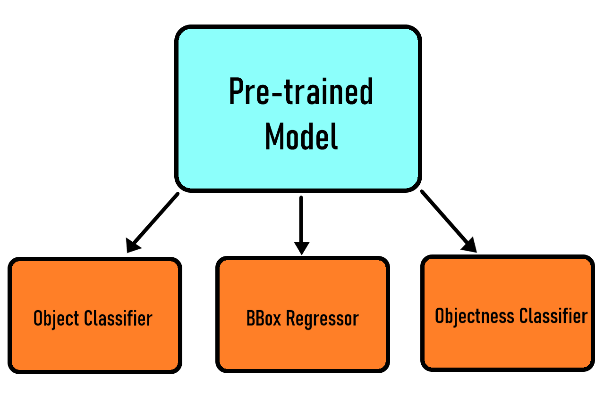
*Figure 1: Model Architecture*

## Data Collection
Most of the images of which the model is trained on are open-source, specifically from Kaggle or free stock image sources online. The [dataset class](dataset.py) used for loading the datasets expects the labels in YOLO (.txt) format, for which most of the images already included YOLO labels. However to further improve the dataset, I ended up using the tool labelImg to manually draw bounding boxes for around 400 images.   
The dataset is varied in the types of images of each animal class, including both close and far shots with one or more animals in distinct evironments.

As mentioned previously, there are seven animal classes each of which having a varying number of images shown in the figure below.
| Animal Class | ID | Total Imgs | # Train Imgs | # Val Imgs | # Test Imgs |
|---|---:|---:|---:|---:|---:|
| Deer | 0 | 995 | 875 | 100 | 20 |
| Moose | 1 | 221 | 176 | 30 | 15 |
| Bear | 2 | 674 | 579 | 85 | 10 |
| Fox | 3 | 648 | 560 | 70 | 18 |
| Wolf | 4 | 316 | 278 | 30 | 8 |
| Bison | 5 | 364 | 317 | 37 | 10 |
| Squirrel | 6 | 639 | 540 | 80 | 19 |

*Figure 2: Animal classes with image counts*

The total number of images in this dataset is 3857.

The dataset is structured in YOLO format with seperate folders for images and labels which split into train/test/val subfolders. 

## Training
I trained the model using the following [training script](model_training.py) as well as CUDA on an RTX 4070 Super for faster training times which allowed me to train much more frequentely while adjusting hyperparameters. 

### Test Loss
The loss functions used for each of the three parts of the model pipeline are fairly standard:

Object classifer: Cross-Entropy Loss

Regressor: Smooth L1 Loss

Objectness classifier: Binary Cross-Entropy Loss with logits

The overall training loss is a weighted sum of these individual loss functions:

**Training Loss = regressor_weight * reg_loss + classifier_weight * class_loss + objectness_weight * objectness_loss**

### Validation Metrics
#### Mean IoU
The Intersection Over Union (IoU) is a popular metric for evalualting the performance of a detector model. It is simply the area of the intersection over of area of the union between predicted and target bounding boxes which is a value between 0 and 1 (higher IoU = better prediction). For this specific project, IoU was used not only as an evaluation metric, but also for matching bounding boxes between target and model predictions. The **mean IoU** is the average over all the predicted bounding boxes that the model detects, indicating regressor performance. 
#### Precision and Recall
Precision is a measure of the % of positive predictions which are actually positive in the image, taking a large penalty from false positives. Meanwhile Recall is the % of objects detected by the model out of the object that are actually in the image, taking a large penalty from false negatives. The harmonic mean of Precision and Recall is the F1 score which establishes a balanced consideration of both. 
#### Class Accuracy
Class accuracy is simply the overall accuracy of the predicted classes for each object, indicating object classifier performance.

Taken together, the overall validation loss given by a weighted sum of each of these metrics:

**Validation Loss =  w_miou * (1 - Mean IoU) + w_class_acc * (1 - Class Accuracy) + w_precision * (1 - Precision) + w_recall * (1 - Recall)**

### Additional Design Choices
* Trained for 30 epochs
* Used Adam as the optimizer with a dynamic learning rate scheduler
* Transformed and normalized the data to 224x224 which is used by ResNet50
* Applied Augmentation on the dataset to increase the dataset diversity, specifically ColorJitter and GaussianBlur

## Test Results

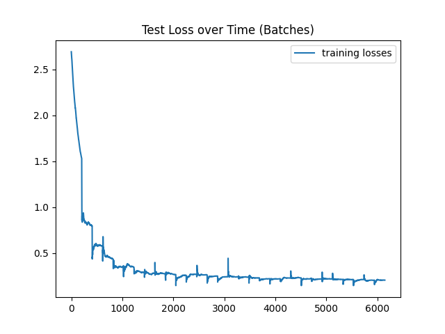  
*Figure 3: Training loss across each batch iteration*

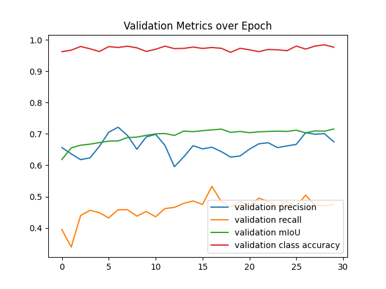  
*Figure 4: Validation metrics across epochs*

When evaluating the model performance on the **test set**, the following stats were recorded:  
**Precision**: 0.7059,   
**Recall**: 0.5882,   
**mIoU**: 0.7503,   
**Class Accuracy**: 0.9500,   
**F1 score**: 0.64169751951  

Here are some of the animals that the model successfully detected from the test set:

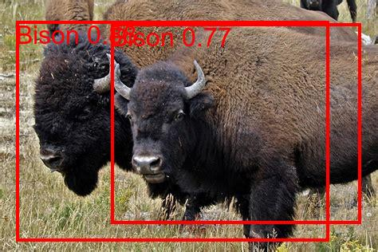
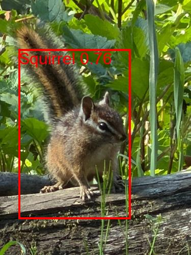

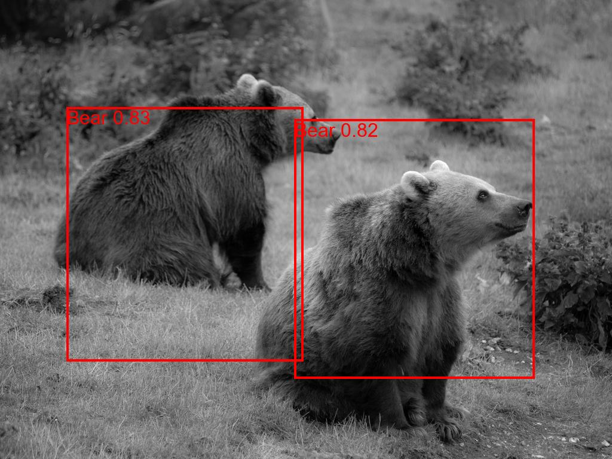

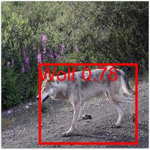
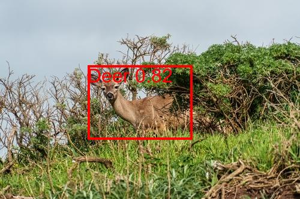

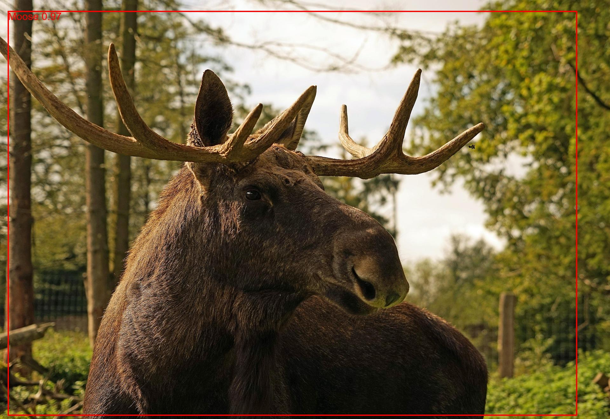

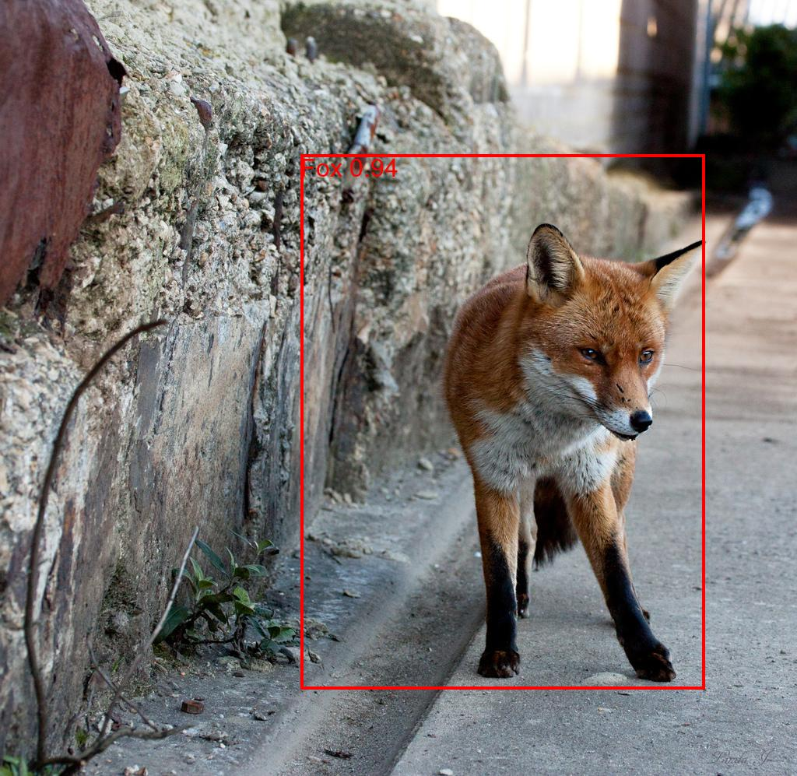

### Wildlife Summary
By utilizing the model post-training and by using the [Wildlife summary script](wildlife_summary.py), the model was able to detect the frequency at which the animals appeared in the wildlife camera footage found in the folder titled 'video'. The following stats and some of the best (highest score given by the model) images are shown below:

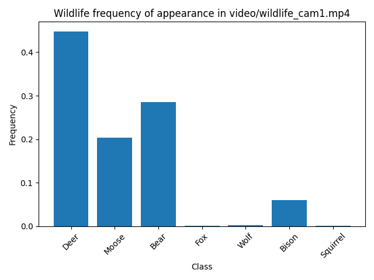  
*Figure 5: Frequency of appearance of animals in the wildlife cam footage*

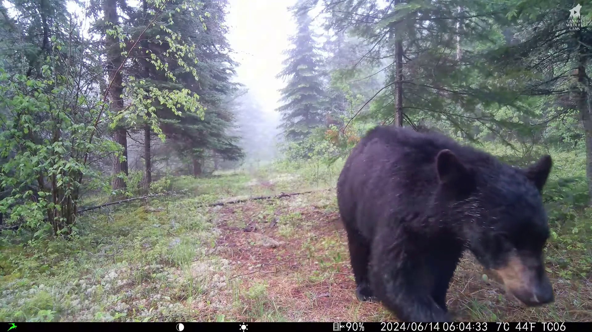  
*Highest Scoring Bear*

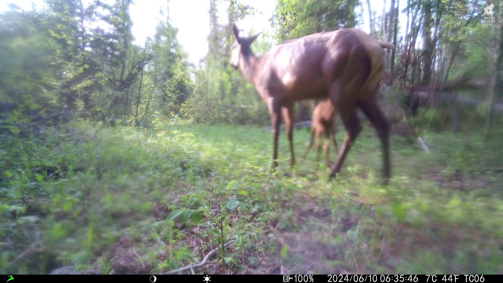  
*Highest Scoring Deer*

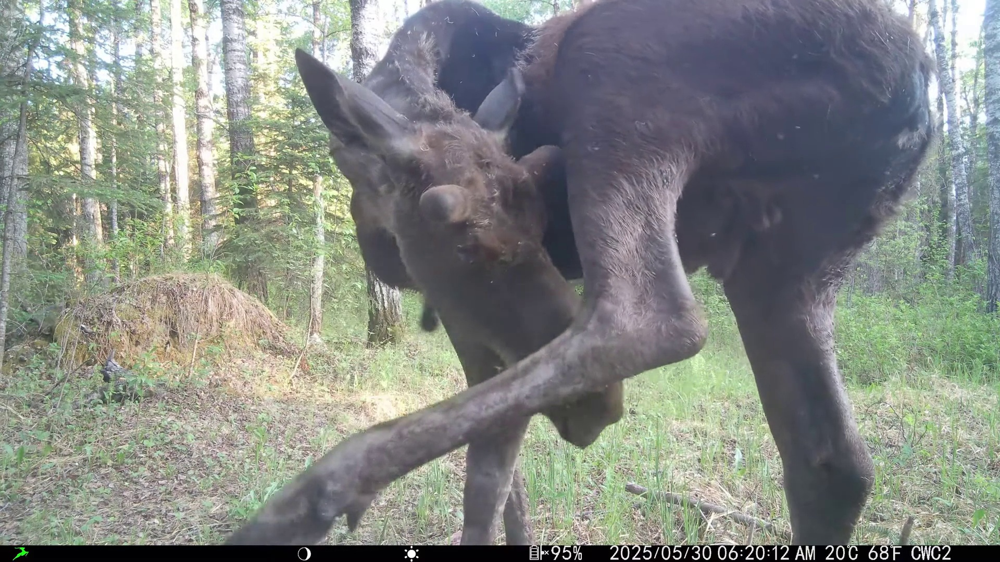   
*Highest Scoring Moose*

## Conclusions and Future Improvements
The overall performance of the model was good considering its simplicity and limited number of parameters. In particular the classification accuracy across all epochs on the validation and test sets was consistently above 95% which indicates that the model is able to effectively distinguish between different objects its detects. The mean IoU was also relatively high meaning the bounding boxes drawn by the model encapsulated most of the object. The weakest aspect of the model performance came from when there were multiple animals on the image as indicated by the low recall score. This likely inherent to the simplistic nature of the model; the model uses a single feature vector from the ResNet50 output for bounding box predictions which loses a large amount of spacial information. Regardless, the F1 score of 0.64 is decent considering the contectual use case of such a model is not necessarily critical as it would be for example a model used to detect early tumor formations in cancer patients.  

The following are future improvements I recognize could be made to optimize model performance:
* Use a fully pretrained model specific for detection such as YOLOv4n (any lightweight and fast YOLO model which already includes preconnected backbone, neck and head components would likely perform well).
* If the main use case the model was on wildlife camera footage, it would be optimal to have the dataset consisting mostly of images taken **directly** from wildlife camera recordings rather than online photos. This would allow the model to learn patterns in the training data that match real world production.
* Use NMS (Non-Maximum Suppression) to reduce redundant overlapping bounding boxes.

## References
### Dataset Sources:

Prelabeled:

https://www.kaggle.com/datasets/shivamchaudharys/wildlife-detetion-yolo-74-class

https://www.kaggle.com/datasets/giotamoraiti/animal-object-detection-dataset-10-classes/data

Manually labelled:

https://www.kaggle.com/datasets/navidre/alberta-wildlife-dataset

https://www.kaggle.com/datasets/elhaddadmohamed/final-datasets-v2

Also a bunch of free google images.

### Wildlife Cam footage:

https://www.youtube.com/@CanadaWildlifeCams

